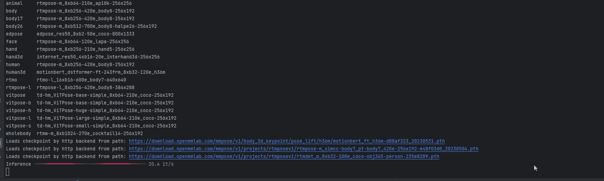
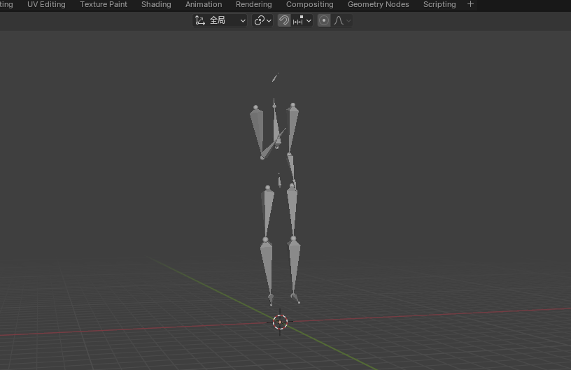
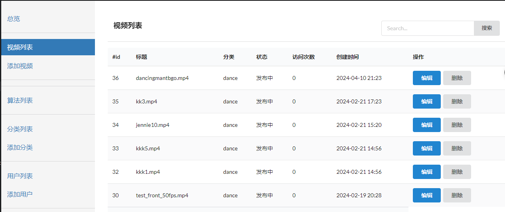

<h1 align="center">
 Key Video Mocap
</h1>

跨平台的视频动作捕捉软件
采用前后端分离的模式，此为后端，调用算法模型，进行视频分析，推理生成bvh动捕数据。

- [前端项目地址](https://github.com/GianKey/KeyAnimeCap) 前端负责3D模型管理。用户交互，驱动后端及展示功能.

## Features

- 视频管理
  - 连接数据库，可上传，删除，修改，展示视频。
- 算法模型管理
  - 可选择多种模型，进行视频动捕的推理
- 动捕数据处理
  - 处理算法模型的结果，通过节点的坐标计算生成bvh文件
  - 将生成的bvh数据传送到前端

## 展示

#### 动捕界面
- 动捕推理
- 推理结果可视化
- 结果导入到blender
- 数据库管理 

## 模型库

<b>支持的算法</b>

- [x] [DeepPose](https://mmpose.readthedocs.io/zh_CN/latest/model_zoo_papers/algorithms.html#deeppose-cvpr-2014) (CVPR'2014)
- [x] [CPM](https://mmpose.readthedocs.io/zh_CN/latest/model_zoo_papers/backbones.html#cpm-cvpr-2016) (CVPR'2016)
- [x] [Hourglass](https://mmpose.readthedocs.io/zh_CN/latest/model_zoo_papers/backbones.html#hourglass-eccv-2016) (ECCV'2016)
- [x] [SimpleBaseline3D](https://mmpose.readthedocs.io/zh_CN/latest/model_zoo_papers/algorithms.html#simplebaseline3d-iccv-2017) (ICCV'2017)
- [ ] [Associative Embedding](https://mmpose.readthedocs.io/zh_CN/latest/model_zoo_papers/algorithms.html#associative-embedding-nips-2017) (NeurIPS'2017)
- [x] [SimpleBaseline2D](https://mmpose.readthedocs.io/zh_CN/latest/model_zoo_papers/algorithms.html#simplebaseline2d-eccv-2018) (ECCV'2018)
- [x] [DSNT](https://mmpose.readthedocs.io/zh_CN/latest/model_zoo_papers/algorithms.html#dsnt-2018) (ArXiv'2021)
- [x] [HRNet](https://mmpose.readthedocs.io/zh_CN/latest/model_zoo_papers/backbones.html#hrnet-cvpr-2019) (CVPR'2019)
- [x] [IPR](https://mmpose.readthedocs.io/zh_CN/latest/model_zoo_papers/algorithms.html#ipr-eccv-2018) (ECCV'2018)
- [x] [VideoPose3D](https://mmpose.readthedocs.io/zh_CN/latest/model_zoo_papers/algorithms.html#videopose3d-cvpr-2019) (CVPR'2019)
- [x] [HRNetv2](https://mmpose.readthedocs.io/zh_CN/latest/model_zoo_papers/backbones.html#hrnetv2-tpami-2019) (TPAMI'2019)
- [x] [MSPN](https://mmpose.readthedocs.io/zh_CN/latest/model_zoo_papers/backbones.html#mspn-arxiv-2019) (ArXiv'2019)
- [x] [SCNet](https://mmpose.readthedocs.io/zh_CN/latest/model_zoo_papers/backbones.html#scnet-cvpr-2020) (CVPR'2020)
- [ ] [HigherHRNet](https://mmpose.readthedocs.io/zh_CN/latest/model_zoo_papers/backbones.html#higherhrnet-cvpr-2020) (CVPR'2020)
- [x] [RSN](https://mmpose.readthedocs.io/zh_CN/latest/model_zoo_papers/backbones.html#rsn-eccv-2020) (ECCV'2020)
- [x] [InterNet](https://mmpose.readthedocs.io/zh_CN/latest/model_zoo_papers/algorithms.html#internet-eccv-2020) (ECCV'2020)
- [ ] [VoxelPose](https://mmpose.readthedocs.io/zh_CN/latest/model_zoo_papers/algorithms.html#voxelpose-eccv-2020) (ECCV'2020)
- [x] [LiteHRNet](https://mmpose.readthedocs.io/zh_CN/latest/model_zoo_papers/backbones.html#litehrnet-cvpr-2021) (CVPR'2021)
- [x] [ViPNAS](https://mmpose.readthedocs.io/zh_CN/latest/model_zoo_papers/backbones.html#vipnas-cvpr-2021) (CVPR'2021)
- [x] [Debias-IPR](https://mmpose.readthedocs.io/zh_CN/latest/model_zoo_papers/algorithms.html#debias-ipr-iccv-2021) (ICCV'2021)
- [x] [SimCC](https://mmpose.readthedocs.io/zh_CN/latest/model_zoo_papers/algorithms.html#simcc-eccv-2022) (ECCV'2022)

<b>支持的技术</b>

- [x] [FPN](https://mmpose.readthedocs.io/zh_CN/latest/model_zoo_papers/techniques.html#fpn-cvpr-2017) (CVPR'2017)
- [x] [FP16](https://mmpose.readthedocs.io/zh_CN/latest/model_zoo_papers/techniques.html#fp16-arxiv-2017) (ArXiv'2017)
- [x] [Wingloss](https://mmpose.readthedocs.io/zh_CN/latest/model_zoo_papers/techniques.html#wingloss-cvpr-2018) (CVPR'2018)
- [x] [AdaptiveWingloss](https://mmpose.readthedocs.io/zh_CN/latest/model_zoo_papers/techniques.html#adaptivewingloss-iccv-2019) (ICCV'2019)
- [x] [DarkPose](https://mmpose.readthedocs.io/zh_CN/latest/model_zoo_papers/techniques.html#darkpose-cvpr-2020) (CVPR'2020)
- [x] [UDP](https://mmpose.readthedocs.io/zh_CN/latest/model_zoo_papers/techniques.html#udp-cvpr-2020) (CVPR'2020)
- [x] [Albumentations](https://mmpose.readthedocs.io/zh_CN/latest/model_zoo_papers/techniques.html#albumentations-information-2020) (Information'2020)
- [x] [SoftWingloss](https://mmpose.readthedocs.io/zh_CN/latest/model_zoo_papers/techniques.html#softwingloss-tip-2021) (TIP'2021)
- [x] [RLE](https://mmpose.readthedocs.io/zh_CN/latest/model_zoo_papers/techniques.html#rle-iccv-2021) (ICCV'2021)

可在 [模型库](https://mmpose.readthedocs.io/zh_CN/latest/model_zoo.html) 页面中查看。

## Dependencies

- [MMDetection](https://github.com/open-mmlab/mmdetection): OpenMMLab 目标检测工具箱
- [MMPose](https://github.com/open-mmlab/mmpose): OpenMMLab 姿态估计工具箱

